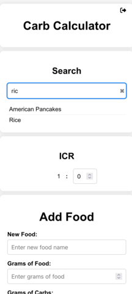
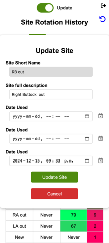

# Food and site

A web application that combines two tools, both of which can be installed as a PWA.
1. **Food Carb Calculator**: A tool to store, calculate the carb content based on weight of food, a calculate insulin dosage based on ICR.
2. **Site Rotation History**: A feature to track site rotation.

---
## Caution

If hosting and making this available on the internet, please for the love of security have SSL setup.

## Features

### 1. Food Carb Calculator
The **Food Carb Calculator** helps you store the carbs as a ratio of weight of food.

1. Add / Update food

 

2. Search and calculate

  


### 2. Site Rotation History
The **Site Rotation History** feature allows you to track and manage pump infusion site rotation history.

1. Main page gives you the option of viewing or adding a new site (slide the switch to change from readonly mode for adding a site entry)

      

2. Prevents a new site being added within 2 hours of the last one, but can be done by first restoring a previous history or modifying the last used site.


3. Older site histories are kept as backups for the last 7 days (over 2 site changes)

  


---

## Setup


### Configuration file

The file gives you a place to create your users, and some bells 
```
; You can set multiple username and passwords, plaintext passwords are overwritten with bcrypt hashed passwords on the first access.
[users]
foo = bar

; To increase or decrease the session (login) timeout
[session_timeout]
timeout = 600

; This is provided to allow access without a password for cases where the app is going to be setup in a homelab.
[allowed_ip_ranges]
; 0 = 10.6.0.0/16
; 1 = 192.168.0.0/24
; 2 = 172.18.0.1

; Do not change this for docker, unless you want to build it yourself
; (use this path for reverse proxy)
[paths]
rootPath = /foodsite

[rate_limit]
max_login_attempts = 5
rl_login_time_window = 60

; Switch between "sqlite" or "mysql"
[database]
dbtype = sqlite

; The db that stores the food and carbs
; Do not change this for docker
[sqlite]
location = sqdblite
name = carbsimple

; Don't bother with mysql, its meant for folks who want to do things a bit different
[mysql]
host = localhost
user = food
password = mypassword
name = carbsimple

```

### Using Docker

1. Create a copy of `appvol/conf/config.ini.sample` and setup your username and password
```
cp appvol/conf/config.ini.sample appvol/conf/config.ini
```
2. Run 

```
docker-compose up
```

### Without Docker

To set up the project, follow these steps:

### Prerequisites
- **Node.js** and **npm**: Required for building the React app.
- **PHP**: Required for the backend.
- **Apache** or **Nginx**: To serve the application.
- **Git**: To clone the repository.

### Step 1: Clone the Repository
Clone the repository to your local machine:
```bash
git clone https://github.com/shoaib42/food-site.git
cd food-site
```

### Step 2: Run the Setup Script
Use the `setup.sh` script to configure the project:
```bash
./setup.sh <work_dir> <web_server> [root_path]
```

#### Arguments:
- `<work_dir>`: The local working directory (e.g., `myapp`).
- `<web_server>`: The web server type (`apache` or `nginx`).
- `[root_path]`: Optional root path for the web server (e.g., `myapp`). Defaults to empty (root of the domain).

#### Example:
```bash
./setup.sh myapp apache foodsite
```

This will:
1. Build the React app.
2. Generate the necessary configuration files for your web server.
3. Provide instructions for deploying the application.
4. The deployable directory and configuration file will be generated in the `output` directory.

### Step 3: Deploy the Application
Follow the instructions printed by the `setup.sh`

---

### Site data schema

*Note that the schema has changed from an array of site objects to the one following to avoid duplications
If you are using the older version please convert to the newer schema*

`site_data.json` has the following schema, time is stored as epoch milliseconds and 0 will be treated as Never
```
{
    "<Short string1>" : {
        "full": "<Descriptive string1>",
        "oldest": <epoch>,
        "beforeLast": <epoch>,
        "last": <epoch>
    },
    ...
    "<Short stringN>" : {
        "full": "<Descriptive stringN>",
        "oldest": <epoch>,
        "beforeLast": <epoch>,
        "last": <epoch>
    },
}
```

---

## Contributing
Contributions are welcome!

---

## License


---

[Apache License 2.0](LICENSE)

---

## Support
If you encounter any issues or have questions, please [open an issue](https://github.com/shoaib42/food-site/issues) on GitHub.